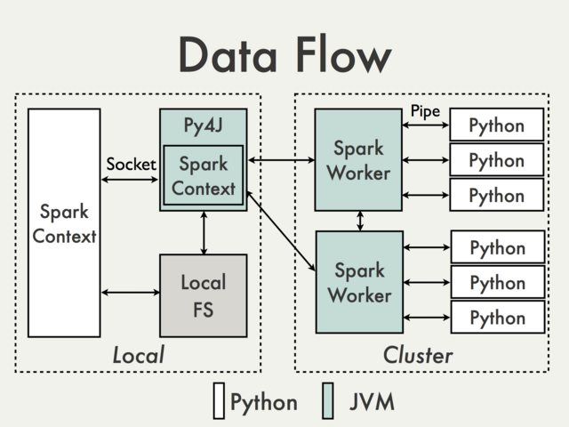

---
jupytext:
  formats: ipynb,md:myst
  text_representation:
    extension: .md
    format_name: myst
    format_version: '0.9'
    jupytext_version: 1.5.2
kernelspec:
  display_name: Python 3
  language: python
  name: python3
---

# PySpark


+++

- [Apache Spark](https://spark.apache.org) was first released in 2014. 
- It was originally developed by [Matei Zaharia](http://people.csail.mit.edu/matei) as a class project, and later a PhD dissertation, at University of California, Berkeley.
- Spark is written in [Scala](https://www.scala-lang.org).
- All images come from [Databricks](https://databricks.com/product/getting-started-guide).

+++

- Apache Spark is a fast and general-purpose cluster computing system. 
- It provides high-level APIs in Java, Scala, Python and R, and an optimized engine that supports general execution graphs.
- Spark can manage "big data" collections with a small set of high-level primitives like `map`, `filter`, `groupby`, and `join`.  With these common patterns we can often handle computations that are more complex than map, but are still structured.
- It also supports a rich set of higher-level tools including [Spark SQL](https://spark.apache.org/docs/latest/sql-programming-guide.html) for SQL and structured data processing, [MLlib](https://spark.apache.org/docs/latest/ml-guide.html) for machine learning, [GraphX](https://spark.apache.org/docs/latest/graphx-programming-guide.html) for graph processing, and Spark Streaming.

+++

## Resilient distributed datasets

- The fundamental abstraction of Apache Spark is a read-only, parallel, distributed, fault-tolerent collection called a resilient distributed datasets (RDD).
- RDDs behave a bit like Python collections (e.g. lists).
- When working with Apache Spark we iteratively apply functions to every item of these collections in parallel to produce *new* RDDs.
- The data is distributed across nodes in a cluster of computers.
- Functions implemented in Spark can work in parallel across elements of the collection.
- The  Spark framework allocates data and processing to different nodes, without any intervention from the programmer.
- RDDs automatically rebuilt on machine failure.

+++

## Lifecycle of a Spark Program

1. Create some input RDDs from external data or parallelize a collection in your driver program.
2. Lazily transform them to define new RDDs using transformations like `filter()` or `map()`
3. Ask Spark to cache() any intermediate RDDs that will need to be reused.
4. Launch actions such as count() and collect() to kick off a parallel computation, which is then optimized and executed by Spark.

+++

## Operations on Distributed Data

- Two types of operations: **transformations** and **actions**
- Transformations are *lazy* (not computed immediately) 
- Transformations are executed when an action is run

+++

## [Transformations](https://spark.apache.org/docs/latest/rdd-programming-guide.html#transformations) (lazy)

```
map() flatMap()
filter() 
mapPartitions() mapPartitionsWithIndex() 
sample()
union() intersection() distinct()
groupBy() groupByKey()
reduceBy() reduceByKey()
sortBy() sortByKey()
join()
cogroup()
cartesian()
pipe()
coalesce()
repartition()
partitionBy()
...
```

+++

## [Actions](https://spark.apache.org/docs/latest/rdd-programming-guide.html#actions)

```
reduce()
collect()
count()
first()
take()
takeSample()
saveToCassandra()
takeOrdered()
saveAsTextFile()
saveAsSequenceFile()
saveAsObjectFile()
countByKey()
foreach()
```

+++

## Python API

PySpark uses Py4J that enables Python programs to dynamically access Java objects.



+++

## The `SparkContext` class

- When working with Apache Spark we invoke methods on an object which is an instance of the `pyspark.SparkContext` context.

- Typically, an instance of this object will be created automatically for you and assigned to the variable `sc`.

- The `parallelize` method in `SparkContext` can be used to turn any ordinary Python collection into an RDD;
    - normally we would create an RDD from a large file or an HBase table.

+++

## First example

PySpark isn't on sys.path by default, but that doesn't mean it can't be used as a regular library. You can address this by either symlinking pyspark into your site-packages, or adding pyspark to sys.path at runtime. [findspark](https://github.com/minrk/findspark) does the latter.

We have a spark context sc to use with a tiny local spark cluster with 4 nodes (will work just fine on a multicore machine).

If you use the workstation in room A111 run the code below before:

```{code-cell} ipython3
import findspark
import os
os.environ["JAVA_HOME"] = "/usr/lib/jvm/java-8-openjdk-amd64",
os.environ["SPARK_HOME"] = "/home/work/spark-3.1.0-bin-hadoop2.7"

findspark.init()
```

```{code-cell} ipython3
import sys
sys.executable
```

```{code-cell} ipython3
import sys, os
os.environ["PYSPARK_PYTHON"] = sys.executable
```

```{code-cell} ipython3
import pyspark

sc = pyspark.SparkContext(master="local[*]", appName="FirstExample")
sc.setLogLevel("ERROR")
```

```{code-cell} ipython3
print(sc) # it is like a Pool Processor executor
```

## Create your first RDD

```{code-cell} ipython3
rdd = sc.parallelize(list(range(8))) # create collection

rdd
```

### Exercise

Create a file `sample.txt`with lorem package. Read and load it into a RDD with the `textFile` spark function.

```{code-cell} ipython3
import lorem

with open("sample.txt","w") as f:
    f.write(lorem.text())
    
rdd = sc.textFile("sample.txt")
```

### Collect

Action / To Driver: Return all items in the RDD to the driver in a single list


Source: https://i.imgur.com/DUO6ygB.png

### Exercise 

Collect the text you read before from the `sample.txt`file.

+++

### Map

Transformation / Narrow: Return a new RDD by applying a function to each element of this RDD


Source: http://i.imgur.com/PxNJf0U.png

```{code-cell} ipython3
rdd = sc.parallelize(list(range(8)))
rdd.map(lambda x: x ** 2).collect() # Square each element
```

### Exercise

Replace the lambda function by a function that contains a pause (sleep(1)) and check if the `map` operation is parallelized.

+++

### Filter

Transformation / Narrow: Return a new RDD containing only the elements that satisfy a predicate


Source: http://i.imgur.com/GFyji4U.png

```{code-cell} ipython3
# Select only the even elements
rdd.filter(lambda x: x % 2 == 0).collect()
```

### FlatMap

Transformation / Narrow: Return a new RDD by first applying a function to all elements of this RDD, and then flattening the results


```{code-cell} ipython3
rdd = sc.parallelize([1,2,3])
rdd.flatMap(lambda x: (x, x*100, 42)).collect()
```

### Exercise

Use FlatMap to clean the text from `sample.txt`file. Lower, remove dots and split into words.

### GroupBy

Transformation / Wide: Group the data in the original RDD. Create pairs where the key is the output of a user function, and the value is all items for which the function yields this key.


```{code-cell} ipython3
rdd = sc.parallelize(['John', 'Fred', 'Anna', 'James'])
rdd = rdd.groupBy(lambda w: w[0])
[(k, list(v)) for (k, v) in rdd.collect()]
```

### GroupByKey

Transformation / Wide: Group the values for each key in the original RDD. Create a new pair where the original key corresponds to this collected group of values.


```{code-cell} ipython3
rdd = sc.parallelize([('B',5),('B',4),('A',3),('A',2),('A',1)])
rdd = rdd.groupByKey()
[(j[0], list(j[1])) for j in rdd.collect()]
```

### Join

Transformation / Wide: Return a new RDD containing all pairs of elements having the same key in the original RDDs


```{code-cell} ipython3
x = sc.parallelize([("a", 1), ("b", 2)])
y = sc.parallelize([("a", 3), ("a", 4), ("b", 5)])
x.join(y).collect()
```

### Distinct

Transformation / Wide: Return a new RDD containing distinct items from the original RDD (omitting all duplicates)


```{code-cell} ipython3
rdd = sc.parallelize([1,2,3,3,4])
rdd.distinct().collect()
```

### KeyBy

Transformation / Narrow: Create a Pair RDD, forming one pair for each item in the original RDD. The pair’s key is calculated from the value via a user-supplied function.


```{code-cell} ipython3
rdd = sc.parallelize(['John', 'Fred', 'Anna', 'James'])
rdd.keyBy(lambda w: w[0]).collect()
```

## Actions

### Map-Reduce operation 

Action / To Driver: Aggregate all the elements of the RDD by applying a user function pairwise to elements and partial results, and return a result to the driver


```{code-cell} ipython3
from operator import add
rdd = sc.parallelize(list(range(8)))
rdd.map(lambda x: x ** 2).reduce(add) # reduce is an action!
```

### Max, Min, Sum, Mean, Variance, Stdev

Action / To Driver: Compute the respective function (maximum value, minimum value, sum, mean, variance, or standard deviation) from a numeric RDD


+++

### CountByKey

Action / To Driver: Return a map of keys and counts of their occurrences in the RDD


```{code-cell} ipython3
rdd = sc.parallelize([('J', 'James'), ('F','Fred'), 
                    ('A','Anna'), ('J','John')])

rdd.countByKey()
```

```{code-cell} ipython3
# Stop the local spark cluster
sc.stop()
```

### Exercise 10.1 Word-count in Apache Spark

- Write the sample text file

```{code-cell} ipython3
from lorem import text
with open('sample.txt','w') as f:
    f.write(text())
```

- Create the rdd with `SparkContext.textFile method`
- lower, remove dots and split using `rdd.flatMap`
- use `rdd.map` to create the list of key/value pair (word, 1)
- `rdd.reduceByKey` to get all occurences
- `rdd.takeOrdered`to get sorted frequencies of words

All documentation is available [here](https://spark.apache.org/docs/2.1.0/api/python/pyspark.html?highlight=textfile#pyspark.SparkContext) for textFile and [here](https://spark.apache.org/docs/2.1.0/api/python/pyspark.html?highlight=textfile#pyspark.RDD) for RDD. 

For a global overview see the Transformations section of the [programming guide](https://spark.apache.org/docs/latest/rdd-programming-guide.html)


## SparkSession

Since SPARK 2.0.0,  SparkSession provides a single point 
of entry to interact with Spark functionality and
allows programming Spark with DataFrame and Dataset APIs. 

###  $\pi$ computation example

- We can estimate an approximate value for $\pi$ using the following Monte-Carlo method:

1.    Inscribe a circle in a square
2.    Randomly generate points in the square
3.    Determine the number of points in the square that are also in the circle
4.    Let $r$ be the number of points in the circle divided by the number of points in the square, then $\pi \approx 4 r$.
    
- Note that the more points generated, the better the approximation

See [this tutorial](https://computing.llnl.gov/tutorials/parallel_comp/#ExamplesPI).


### Exercise 9.2

Using the same method than the PI computation example, compute the integral
$$
I = \int_0^1 \exp(-x^2) dx
$$
You can check your result with numpy

```{code-cell} ipython3
# numpy evaluates solution using numeric computation. 
# It uses discrete values of the function
import numpy as np
x = np.linspace(0,1,1000)
np.trapz(np.exp(-x*x),x)
```

numpy and scipy evaluates solution using numeric computation. It uses discrete values of the function

```{code-cell} ipython3
import numpy as np
from scipy.integrate import quad
quad(lambda x: np.exp(-x*x), 0, 1)
# note: the solution returned is complex 
```

### Correlation between daily stock

- Data preparation

```{code-cell} ipython3
import os  # library to get directory and file paths
import tarfile # this module makes possible to read and write tar archives

def extract_data(name, where):
    datadir = os.path.join(where,name)
    if not os.path.exists(datadir):
       print("Extracting data...")
       tar_path = os.path.join(where, name+'.tgz')
       with tarfile.open(tar_path, mode='r:gz') as data:
          data.extractall(where)
            
extract_data('daily-stock','data') # this function call will extract json files
```

```{code-cell} ipython3
import json
import pandas as pd
import os, glob

here = os.getcwd()
datadir = os.path.join(here,'data','daily-stock')
filenames = sorted(glob.glob(os.path.join(datadir, '*.json')))
filenames
```

```{code-cell} ipython3
%rm data/daily-stock/*.h5
```

```{code-cell} ipython3
from glob import glob
import os, json
import pandas as pd

for fn in filenames:
    with open(fn) as f:
        data = [json.loads(line) for line in f]
        
    df = pd.DataFrame(data)
    
    out_filename = fn[:-5] + '.h5'
    df.to_hdf(out_filename, '/data')
    print("Finished : %s" % out_filename.split(os.path.sep)[-1])

filenames = sorted(glob(os.path.join('data', 'daily-stock', '*.h5')))  # data/json/*.json
```

### Sequential code

```{code-cell} ipython3
filenames
```

```{code-cell} ipython3
with pd.HDFStore('data/daily-stock/aet.h5') as hdf:
    # This prints a list of all group names:
    print(hdf.keys())
```

```{code-cell} ipython3
df_test = pd.read_hdf('data/daily-stock/aet.h5')
```

```{code-cell} ipython3
%%time

series = []
for fn in filenames:   # Simple map over filenames
    series.append(pd.read_hdf(fn)["close"])

results = []

for a in series:    # Doubly nested loop over the same collection
    for b in series:  
        if not (a == b).all():     # Filter out comparisons of the same series 
            results.append(a.corr(b))  # Apply function

result = max(results)
result
```

### Exercise 9.3

Parallelize the code above with Apache Spark.

+++

- Change the filenames because of the Hadoop environment.

```{code-cell} ipython3
import os, glob

here = os.getcwd()
filenames = sorted(glob.glob(os.path.join(here,'data', 'daily-stock', '*.h5')))
filenames
```

If it is not started don't forget the PySpark context

+++

Computation time is slower because there is a lot of setup, workers creation, there is a lot of communications the correlation function is too small

### Exercise 9.4 Fasta file example

Use a RDD to calculate the GC content of fasta file nucleotide-sample.txt:

$$\cfrac{G+C}{A+T+G+C}\times100 \% $$

Create a rdd from fasta file genome.txt in data directory and count 'G' and 'C' then divide by the total number of bases.

+++

### Another example

Compute the most frequent sequence with 5 bases.
